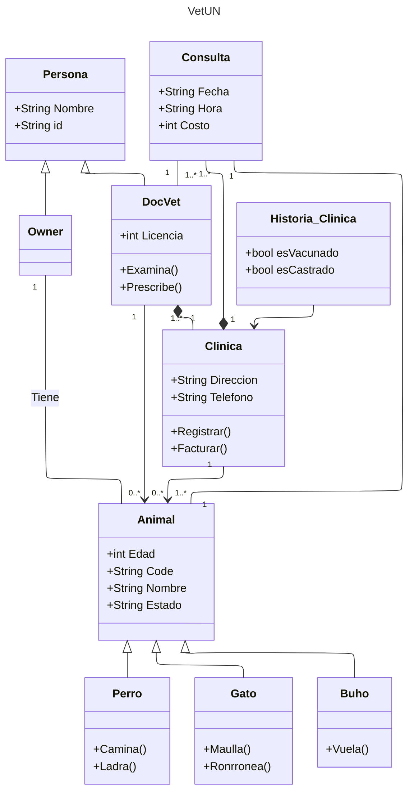

# Programación Orientada a Objetos: Reto 2

En este repositorio están las soluciones al reto de la clase 5 del planteado en [la clase n°5](https://github.com/fegonzalez7/poo_unal_clase5).

Descripción del reto: 

Elija un problema de la vida real (sistema de gestión de biblioteca, negocio de compra-venta, automóvil, etc) que se pueda modelar a través de objetos y clases. Plantee las relaciones de clases, composiciones, propiedades y comportamientos del sistema en uno mas diagramas tipo UML.

## :paw_prints: VetUN: Sistema de gestión de la Clinica para Animales pequeños de la Universidad Nacional.

Elegí modelar el sistema de atención para citas de la clinica para animales pequeños de la universidad en Mermaid: 

